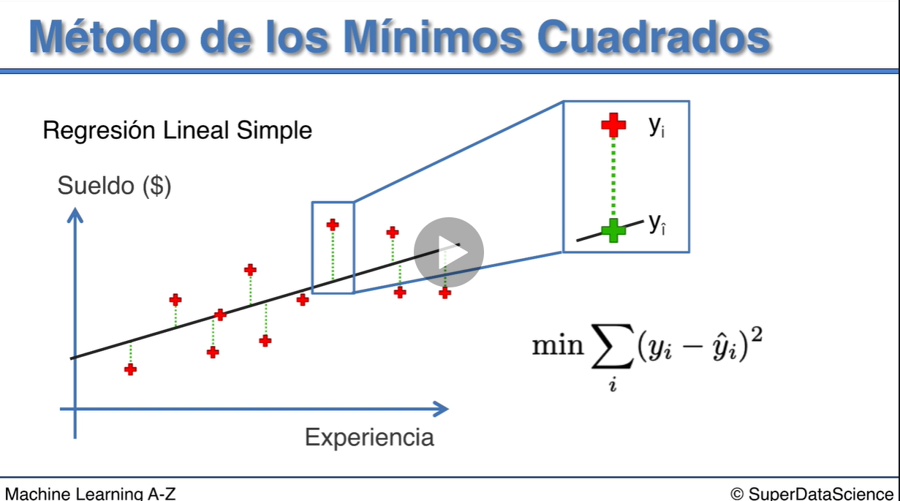

# Regresión Lineal Simple

**y = b0 + b1 * x**

y sería el Sueldo
x seria la Experiencia
b0 sería el sueldo inicial con cero años de experiencia
b1 sería el incremento

**Sueldo = b0 + b1 * Experiencia**

## Método de los Mínimos Cuadrados

