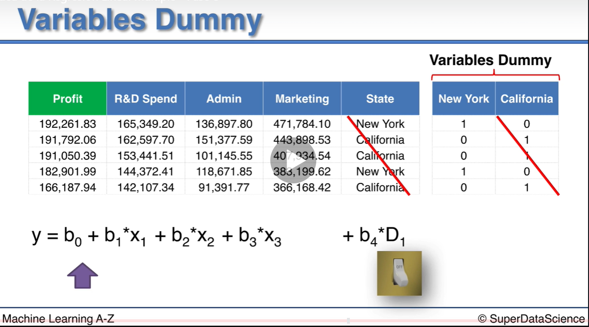
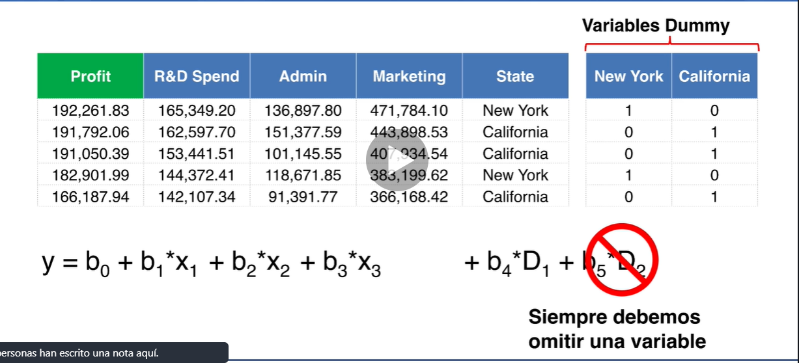
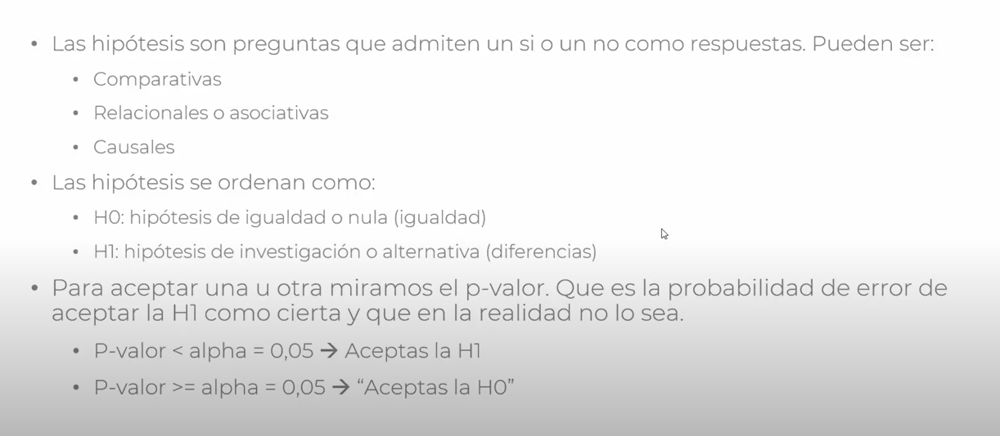

# Regresión Lineal Múltiple

**y = b0 + b1\* x1 + b2\* x2 + ... + bn\* xn**

y -> Variable Dependiente(VD) Ingresos que va a generar la empresa, en el caso de esta sección

x1 x2 ... xn -> Variables Independientes (VIs)

b0 -> Constante, ordenada en el origen

b1 b2 ... bn -> Coeficientes

## Restricciones de la Regresión Lineal

Se tienen que satisfacer las siguientes:

1. Linealidad
2. Homocedasticidad
3. Normalidad multivariable
4. Independencia de los errores
5. Ausencia de multicolinealidad

## Variables Dummies

### La trampa de las Variables Dummies

No se pueden incluir todas las variables ficticias

Se crearía multicolinealidad y hay que evitarlo

**D2 = 1 - D1**

Siempre hay que omitir una de todas las variables Dummies que tengamos

## Conceptos: p-valor

- [Enlace a una explicación de qué es el p-valor](https://conceptosclaros.com/que-es-el-p-valor/)
- [Enlace a un video explicación sobre el p-valor](https://www.youtube.com/watch?v=08H-sdAE0mU)

