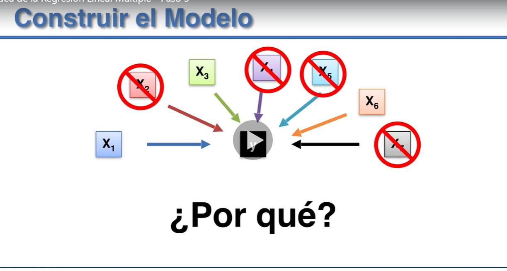
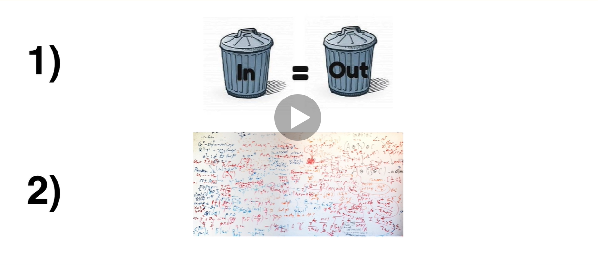
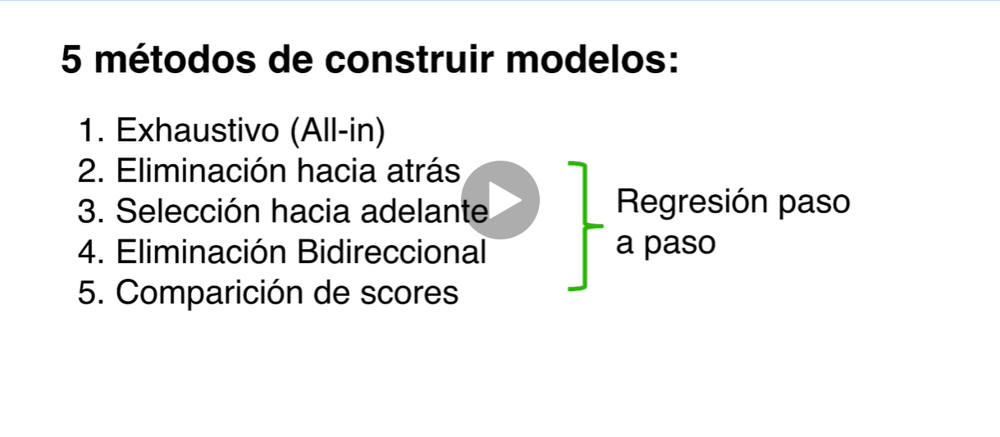
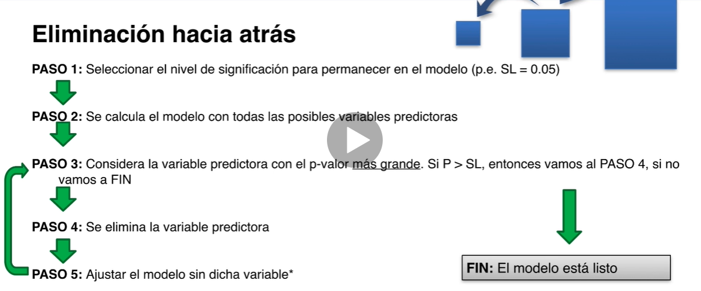
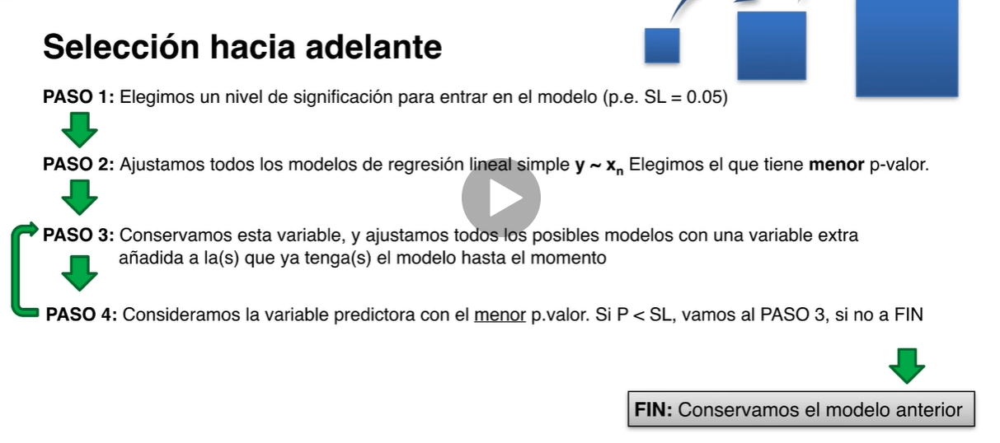
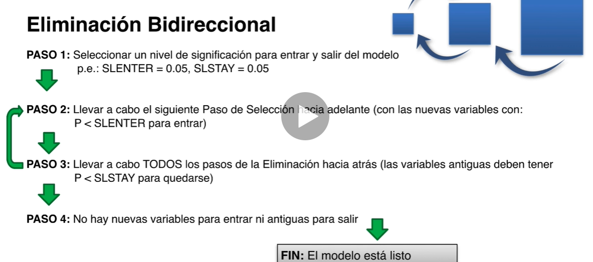
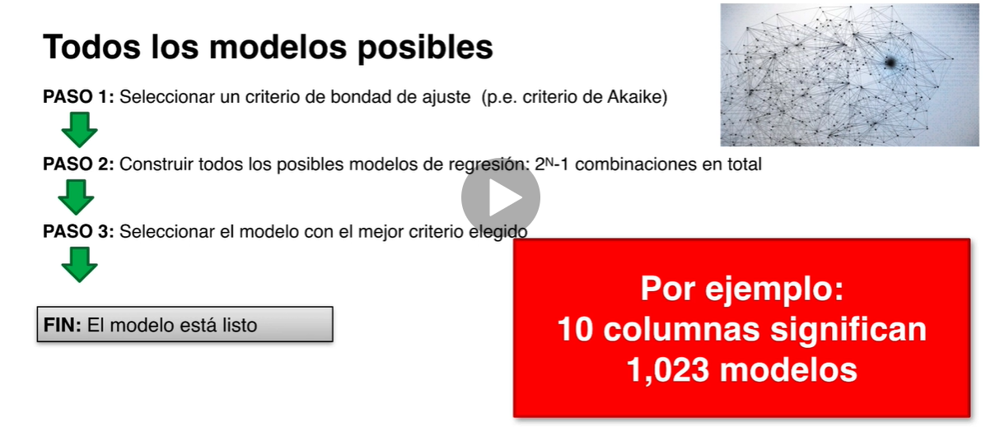

1) No por añadir más variables vamos a obtener más información, si estás no aportan información significativa
2) En el momento de tener que explicar el modelo es más complicado si hay un exceso de variables

1. Exhaustivo (No es recomendable)

2. Eliminación hacia atrás 

3. Selección hacia adelante

4. Eliminación Bidireccional

5. Comparación de scores

