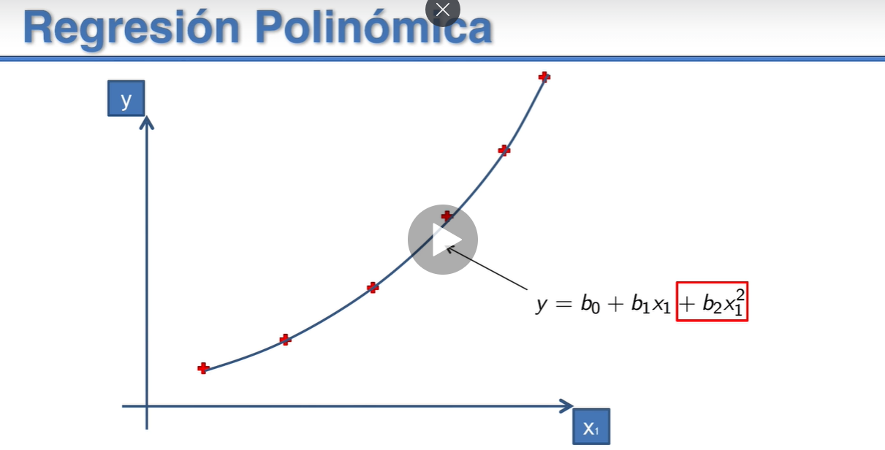

# Regresión Lineal Polinómica

**y = b0 + b1\* x1 + b1\* x12 + ... + bn\* x1n**

y -> Variable Dependiente(VD) Ingresos que va a generar la empresa, en el caso de esta sección

x11->...x1n-> Variable Independiente x1 elevada a las potencias sucesivas de la misma variable (VI)

b0 -> Constante, ordenada en el origen

b1 b2 ... bn -> Coeficientes

Parábola, con una ecuación de segundo grado
Regresión Polinómica de grado 2

