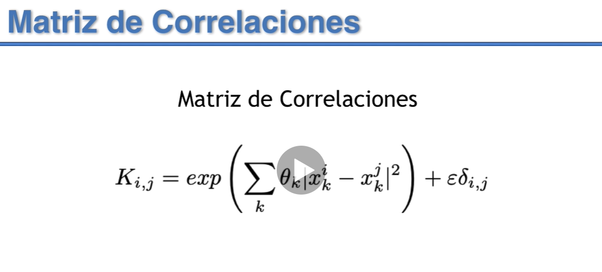

# Regresión con Máquinas de Soporte Vectorial

[Enlace ejemplos svm](http://scikit-learn.org/stable/auto_examples/svm/plot_svm_regression.html#)

[Enlace ejemplo svm](http://link.springer.com/chapter/10.1007/978-1-4302-5990-9_4)

